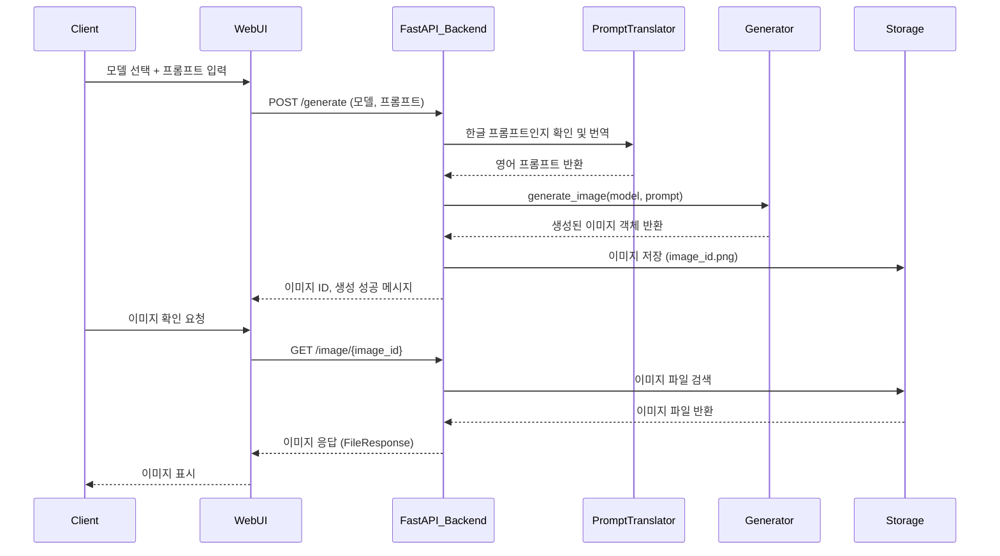

# 📝 요구사항 명세서

## 📌 개요

AI를 이용하여 이미지 및 비디오를 생성하는 모델을 구성하고, 웹사이트를 통해 클라이언트에게 해당 콘텐츠(이미지 및 비디오)를 제공하는 서비스.

---

## 🧠 핵심 기능 흐름

1. **AI 이미지 및 비디오 생성 모델 사용**
2. **클라이언트는 API를 통해 POST 및 GET 메서드로 서비스 이용**
   - 사용자는 웹사이트를 통해 **모델을 선택**하고 **프론프트 입력**
   - 추후 추가 기능으로 더 다양한 인터페이스 제공 예정

---

## ⚙️ 개발 구성

### 1. **AI 생성 모델 모듈화**
- 이미지 및 비디오를 생성하는 AI 모델을 설계
- 각 모델은 모듈 단위로 분리하여 관리

### 2. **한/영 번역기 구성**
- 사용자가 한글로 프론프트를 입력했을 때 영어로 번역
- 번역 로직은 별도 모듈(`MMT.py`)로 구성

### 3. **이미지 생성 모듈 `Generate.py`**
- 모델과 번역기를 사용해 이미지를 생성
- 이미지 생성 함수는 재사용 가능하도록 모듈화하여 유지보수 용이성 확률

### 4. **API 서버 모듈 `Generate_service.py`**
- FastAPI 기반의 웹 서버
- 클라이언트에게 다음 메서드 제공:
  - `POST /generate` : 이미지 생성 요청
  - `GET /models` : 사용 가능한 모델 목록 조회
  - `GET /image/{image_id}` : 생성된 이미지 파일 반환

### 5. **웹사이트 연동**
- 웹사이트에서 클라이언트는 프론프트 입력 및 모델 선택 UI를 통해 API 호출
- 백어드 서버와 연동되어 이미지가 사용자에게 반환됨

---

## 🤩 사용 기술 스택

- **FastAPI**: API 서버 구현
- **Python 모듈화**: 유지보수 편의성을 위한 기능 분리
- **이미지 생성 AI 모델**: (Stable Diffusion 등)
- **영어 번역기**: (MarianMT 사용)
- **Postman**: API 테스트 도구
- **웹 프론트엔드**: (추후 연동 예정)

